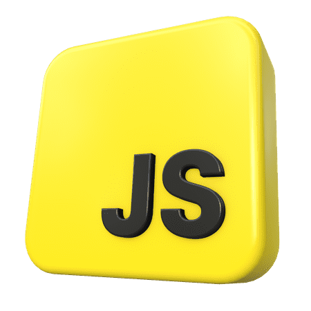
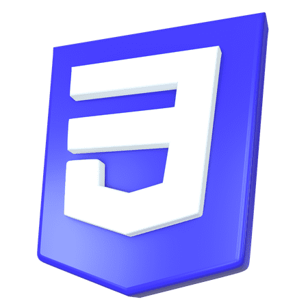
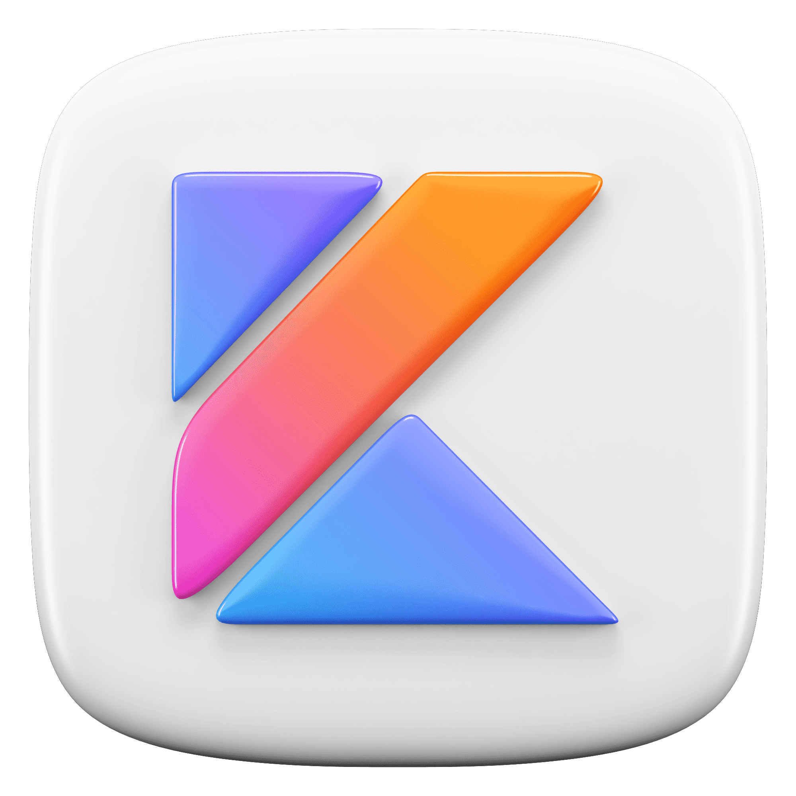

  

## Adout

I am a front-end, android developer and graphic designer, my experience is 2
 years in various projects. First I do the design, then I start programming, 
 this is already the front-end development of an application or a website.
  So far I am developing only my own small projects, so I want to gain 
  experience in large companies to improve my skills and programming.

## Languages and tool

  
  
  
  
  

  
  

  
  

  
  

  
  

  
  

follow me

